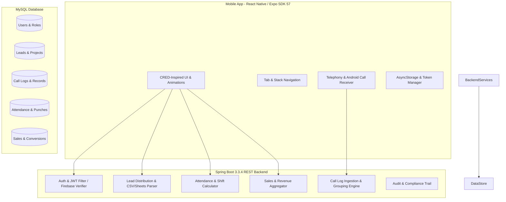
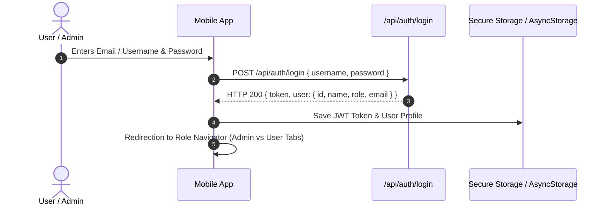

# QMEX Calling CRM — Comprehensive Architecture & Workflow Documentation

---

## 1. Executive Summary

**QMEX Calling CRM** is an enterprise-grade mobile and web customer relationship management system engineered specifically for high-velocity outbound calling, sales conversion tracking, lead distribution, and field employee attendance monitoring.

The system bridges **native telephony on mobile devices (Android/iOS)** with a centralized **Spring Boot backend** and **MySQL database**, providing end-to-end synchronization of call events, recordings, follow-ups, and revenue metrics in real time.

---

## 2. Technology Stack & System Architecture



### Core Technologies:
- **Mobile Client**: React Native 0.86, Expo SDK 57, TypeScript, React Navigation 6, Vector Icons, Animated API.
- **Backend API**: Java 17, Spring Boot 3.3.4, Spring Security, Hibernate/JPA, Firebase Admin SDK, Maven.
- **Database**: MySQL 8.x with Flyway / Hibernate schema migrations.
- **Authentication**: Dual-layer (JWT Token authentication with optional Firebase Auth integration).

---

## 3. User Roles & Permission Matrix

The application provides strict Role-Based Access Control (RBAC):

| Capability / Module | System Administrator (`ADMIN`) | Sales Agent / Employee (`EMPLOYEE` / `USER`) |
| :--- | :---: | :---: |
| **Executive Dashboard** | Company-wide revenue, conversion gauge, aggregated team KPIs | Personal target gauge, personal revenue, assigned leads |
| **Attendance Punching** | Self-punch + Organization-wide employee attendance oversight | Self Clock-in, Clock-out, and shift duration tracker |
| **Project Management** | Create, edit, toggle status, and delete campaign projects | View assigned project containers and campaign leads |
| **Lead Ingestion** | Upload CSV, Sync Google Sheets, Create individual leads | View and manage only assigned leads |
| **Lead Distribution** | Bulk assign, reassign, round-robin, and single allocation | Receives allocated leads automatically |
| **Calling & Telephony** | Organization-wide call audit, duration, and telemetry | Direct dialer, call logging, outcome tagging, follow-ups |
| **Call Grouping** | Grouped by phone number across team or scoped to self | Grouped chronological call history for own calls |
| **Team Management** | Create agent accounts, reset passwords, activate/deactivate | Profile viewing and personal credential updates |
| **Reports & Export** | Executive CSV export, agent performance metrics | Personal sales summaries |

---

## 4. End-to-End Functional Workflows

### 4.1. Authentication & Session Lifecycle


---

### 4.2. Attendance & Shift Monitoring Workflow
1. **Clock-In**:
   - The user opens the app and hits **Clock In** on the Attendance widget.
   - The app records timestamp, geo/network verification, and transitions status to `WORKING`.
2. **Real-Time Duration Ticker**:
   - The UI automatically calculates elapsed working time in real-time (`Xh Ym`).
3. **Clock-Out**:
   - When the user clocks out, total worked minutes are calculated against shift targets (e.g. 9 hours).
   - If duration satisfies threshold, status becomes `PRESENT`; if partial, status becomes `HALF_DAY`.
   - Once clocked out for the day, subsequent punches are locked until the next business calendar day.

---

### 4.3. Lead Ingestion, Pipeline & Distribution Workflow
```mermaid
flowchart TD
    A[Lead Sources: CSV Import / Google Sheets / Manual Entry] --> B[Project Pipeline Ingestion]
    B --> C{Distribution Mode}
    C -->|Manual Assignment| D[Admin selects Agent per Lead]
    C -->|Bulk Distribution| E[Admin distributes N leads evenly among active agents]
    C -->|Round Robin| F[System automatically assigns sequentially]
    D --> G[Agent's "My Leads" Queue]
    E --> G
    F --> G
    G --> H[Agent initiates Telephony Outbound Call]
```

---

### 4.4. Telephony, Calling, Grouping & History Engine
- **Direct Calling**: Agent taps the phone icon on a lead card or dials a custom number on the **Dialer**.
- **Android Intent**: Launches device cellular call handler.
- **Call Event Ingestion**: Timestamp, duration, and status (`CONNECTED`, `MISSED`, `REJECTED`, `BUSY`) are transmitted to `/api/calls`.
- **Smart Phone Grouping (`groupCallsByPhoneNumber`)**:
  - Rather than spamming the call logs with duplicate lines, calls are consolidated by normalized phone number into a single card showing:
    - Contact Name / Number.
    - Latest call timestamp.
    - Total call count pill (e.g., `4 calls`).
    - Missed vs Connected indicator badges.
  - Tapping opens the **Call History Detail Screen** showcasing:
    - KPI capsules (Total Calls, Total Talk Time, Last Outcome).
    - Reverse chronological history log with exact timestamps, talk durations, and notes.

---

### 4.5. Sales Conversion & Follow-up Scheduling
1. **Outcome Tagging**: After a call, the agent logs an outcome (`INTERESTED`, `NOT_INTERESTED`, `BUSY`, `CALLBACK_REQUESTED`).
2. **Follow-Up Promise**: If `CALLBACK_REQUESTED` or `FOLLOW_UP`, the agent specifies callback date & time. The system places this into the **Follow-ups Console** with push reminders.
3. **Closed Deal / Conversion**:
   - If converted, deal value (`₹ Amount`) is entered.
   - System updates `Lead.status = CONVERTED`, registers a new `Sale` record, and recalculates monthly revenue targets and conversion percentages across dashboards.

---

## 5. UI/UX Design System & Aesthetics Specifications

The redesign follows a **CRED-inspired premium light aesthetic**:

| Element | Specification | Visual Representation |
| :--- | :--- | :--- |
| **Canvas Background** | `#F8F9FE` (Soft lavender tint) | Clean, airy canvas avoiding harsh eye strain |
| **Surface Cards** | `#FFFFFF` with `borderRadius: 20-26px` | Floating cards with multi-layered soft shadows |
| **Hero Card** | Multi-stop gradient: `#6366F1 -> #8B5CF6 -> #EC4899` | Revenue + Conversion gauge + Frosted Glass Attendance |
| **Count-up Animations** | `AnimatedNumber` (0 -> Final Value over 800-1000ms) | Dynamic, lively numeric transitions on metrics |
| **Card Entrance** | `AnimatedCard` (Staggered fade, slide-up, scale 0.96 -> 1) | Cards appear smoothly in sequence |
| **Card Shine Effect** | `CardShine` (Diagonal linear gradient sweep) | Premium metallic sheen across key cards |
| **Segmented Control** | `SegmentedControl` (Spring-animated sliding white pill) | Smooth tab switching (Projects / My Leads) |
| **Bottom Tab Bar** | `FloatingTabBar` (Floating rounded capsule with active glowing dot) | Modern mobile navigation with spring scale feedback |

---

## 6. Key API Endpoint Directory

### Authentication & Profiles
- `POST /api/auth/login`: User and Admin login.
- `GET /api/users/me`: Fetch authenticated user profile.
- `GET /api/users`: Admin user directory management.

### Dashboard & Analytics
- `GET /api/dashboard/admin`: Executive KPIs (Revenue, total leads, conversion rate, calls).
- `GET /api/dashboard/user`: Agent personal metrics (Calls today, assigned leads, monthly revenue).
- `GET /api/analytics/overview`: Company-wide graphical analytics with date filters (`TODAY`, `WEEK`, `MONTH`).

### Leads & Projects
- `GET /api/projects`: List active campaign projects.
- `POST /api/projects`: Create a new project container.
- `GET /api/leads`: Searchable, filterable lead directory.
- `POST /api/leads`: Create new lead.
- `PUT /api/leads/{id}`: Update lead status, notes, or outcome.
- `POST /api/leads/assign`: Lead assignment and distribution.

### Telephony & Calls
- `POST /api/calls`: Record call event with timestamp, duration, and status.
- `GET /api/calls/my-calls`: Fetch authenticated user's call logs.
- `GET /api/calls/organization`: Admin telemetry audit of all organization calls.

### Attendance
- `GET /api/attendance/today`: Today's punch status and duration.
- `POST /api/attendance/clock-in`: Record clock-in punch.
- `POST /api/attendance/clock-out`: Record clock-out punch and finalize duration.
- `GET /api/attendance/history`: Historical monthly attendance calendar.

---

## 7. Developer & Operational Runbook

### Running the Backend
```bash
cd backend
./mvnw.cmd spring-boot:run
# Server runs on http://localhost:8080
```

### Running the Mobile Client
```bash
cd mobile
npx expo start -c
# Or run on Android emulator / physical device:
npx expo run:android
```

### Validating TypeScript Code Quality
```bash
cd mobile
npx tsc --noEmit
# Must complete with 0 errors
```
